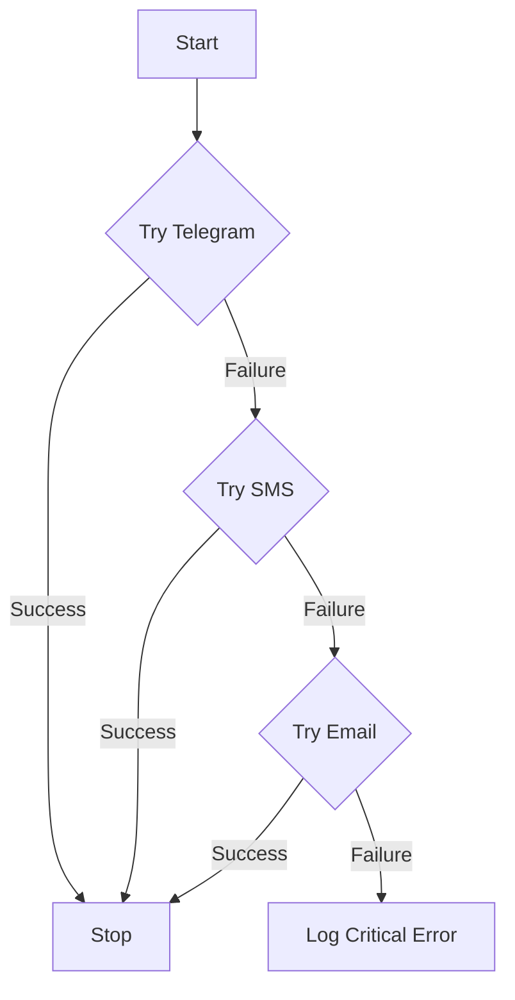

# NotifyUser 🔔

**Fault-tolerant, multi-channel notification system with automatic failover strategies.**


## 📖 Overview

NotifyUser is a robust notification service designed to ensure critical messages reach the user, no matter what. It implements a **Chain of Responsibility** pattern to handle delivery failures.

If the primary channel (e.g., Telegram) is down or unreachable, the system automatically fails over to the next available channel (SMS), and finally to Email.

### 🔄 Failover Logic



## 🚀 Key Features

* **Asynchronous Core:** Built on `asyncio` for non-blocking I/O operations.
* **Plug-in Architecture:** Dynamic module loading allows adding new notification providers (e.g., Slack, WhatsApp) without changing the core logic.
* **Failover Strategy:** Automatic switching between providers upon failure.
* **Configurable Environment:** Supports `.env` configuration for secure credential management.
* **Test Mode:** Ability to broadcast to ALL channels simultaneously for debugging.

## 🛠 Tech Stack

- **Core:** Python 3.10+
- **Logging:** Loguru (Structured logging)
- **Telegram:** Aiogram 3.x
- **SMS:** MTS Exolve API
- **Configuration:** python-dotenv

## ⚙️ Installation & Setup

1. **Clone the repository:**
   ```bash
   git clone https://github.com/S1erben13/NotifyUser.git
   cd NotifyUser
   ```

2. **Create a virtual environment:**
   ```bash
   python -m venv venv
   source venv/bin/activate  # On Windows: venv\Scripts\activate
   ```

3. **Install dependencies:**
   ```bash
   pip install -r requirements.txt
   ```

4. **Configuration:**
   Rename `.env.example` to `.env` and fill in your credentials.

   ```ini
   # Global Settings
   TEST=False          # If True: Sends to ALL channels. If False: Stops after first success.
   MESSAGE="Alert!"    # Default message content

   # Telegram Credentials
   TELEGRAM_BOT_TOKEN=your_token
   TELEGRAM_USER_ID_TARGET=123456789

   # SMS (MTS Exolve)
   PHONE_NUMBER_APP=79990000000
   PHONE_NUMBER_TARGET=79991111111
   API_KEY=exolve_api_key

   # Email (SMTP)
   DOMAIN=smtp.gmail.com
   PORT=587
   LOGIN=your_email@gmail.com
   PASSWORD=app_password
   EMAIL_TARGET=target@gmail.com
   ```

## 🏃 Usage

Run the main entry point:

```bash
python main.py
```

### Extending the System

To add a new notification channel (e.g., `Discord`):

1.  Create `notifiers/discord.py`.
2.  Implement a class `NotifyDiscord` with a `notify_user(message)` method.
3.  Register it in `main.py`:
    ```python
    NOTIFIERS = [
        ("telegram", "NotifyTelegram"),
        ("discord", "NotifyDiscord"), # Added logic
        ...
    ]
    ```

---
*Created by [Vladimir Popov](https://github.com/S1erben13)*
